# Hello World

## Introduction

Let me start by introducing myself. I'm Will Gordon, owner of Gordon Code, currently focused on freelance automation development. If you're interested in any custom business workflows, dashboards, automation, etc., please reach out to me at [will@gordoncode.dev](mailto:will@gordoncode.dev?subject=Looking%20for%20freelance%20developement)!

I offer 14 years of automation, development, and business experience, along with a bachelor's of computer science from Rochester Institute of Technology. My automation focus utilizes python-based solutions, however I can be flexible based on your needs. I'm currently employed at Red Hat since 2016, moving from customer solution engineer for OpenShift Online, to product manager for Red Hat OpenShift Service on AWS (ROSA), and most recently a principal site reliability engineer (SRE) for managed OpenShift.

## How did this blog start?

<figure align="center">
	
  <figcaption><small><em>If you Give a Mouse a Cookie book cover - Fair use</em></small></figcaption>
</figure>
As all things tend to start in technology, all I wanted to do was something simple...set up my new Mac Mini. From there, I went down a rabbit hole

```mermaid
flowchart TD
	macmini{{🖥️ Setup my Mac Mini}} --> provisioner([🚀 What's the best provisioner-as-code for my new mac?])
	provisioner --> testing([🤔 What's a good way to test the provisioner?])
	testing --> taskrunner([🏃‍♂️‍➡️ What should I use to script my test running?])
	taskrunner --> blog{{🧠 Wow, I put a lot of research into that, I should share my notes in a blog!}}
	blog --> ssg([⚙️ What are the best static site generators nowadays?])
	ssg --> host([☁️ Where should I host my new SSG blog?])
	host --> md-writer([📝 I'd like to have a good Markdown text editor, what should I use?])
	md-writer --> here>🧑‍💻 And here you are, blog's are WIP for each node above!]
	%% Example how to add links to nodes
	%% click provisioner href "./comparing-hosts.md" "This is a tooltip"
```

## What to write about?

Between all of my work as

- A one-man IT team
- Database design and administration
- Home network and automation guru
- Web developer
- Kubernetes/OpenShift developer
- Product manager
- Kubernetes/OpenShift administrator

I think it makes a _lot_ of sense for this to be a technology-focused blog. Writing about my experiences with new products, research and comparisons into existing products, and general tinkering. But I'm also a father of 2 boys, a home owner, and an occasional traveler; so it probably makes good sense to drop a few blogs in about these various topics as well!

## Conclusion

Thanks to y'all who have made it reading this far. I hope everyone can enjoy and learn from my content! If you have any comments, or come across any problems, I encourage you to open an issue on my [GitHub repo](link here).
